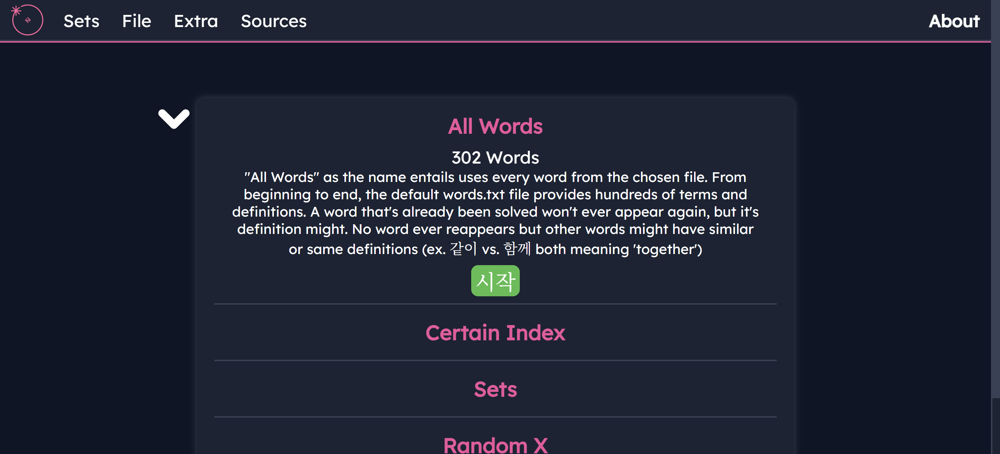
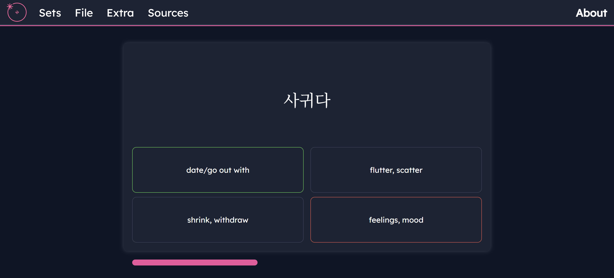
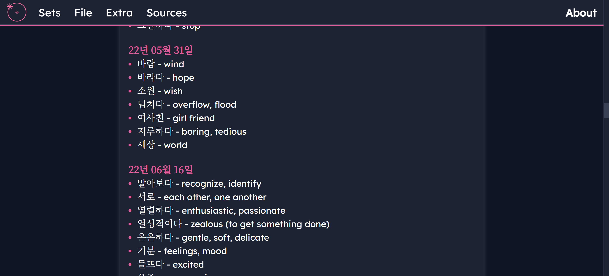

# Quizlet
A quizlet-esque website featuring 4 distinct gamemodes and 300+ Korean words to study from. Created so I could learn Korean better when I previously self-taught myself Korean.

# Installation
No install required, it's a website! Check it out [here!](https://hydrohaven.github.io/Quizlet/)

# Images

_Homepage where all 4 gamemodes are displayed with their descriptions and start buttons_\
\

_A quiz menu akin to Quizlet's "Test" function_\
\

_List of words and definitions loaded from a local .txt_

# Future Updates
So I made this website in the summer after graduating from high school and at the time, I just wanted to learn HTML, CSS, JavaScript because I wanted to gain that barebones webdev experience. In the future, I wanted to add some sort of database system and SQL integration in this project where users could load their OWN .txt files or import from Quizlet itself. I made this website because at the time Quizlet locked their "Test" feature behind a paywall. 
